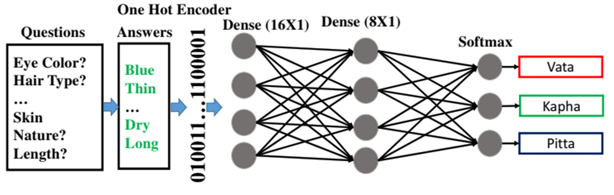

### Publication
Classification of Ayurveda constitution types: A Deep
Learning Approach, 
By : Debnarayan Khatua, Arif Ahmed Sekh, Rintu Kutum, Mitali Mukherji, Bhavana
Prasher, and Samarjit Kar
In: Consideration

[Link to The Paper](https:xxxx)

### Dataset Description
To be Added
### License

Copyright © 2022 Sk. Arif Ahmed

The content of this repository is bound by the following licenses:

- The documents and data are licensed under the MIT license.
